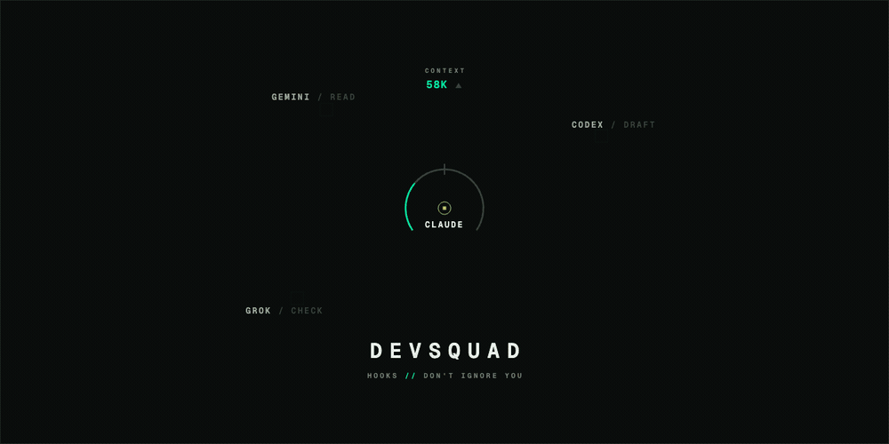

<div align="center">

# DevSquad

### Your AI coding agent ignores your rules. Hooks don't.

**DevSquad turns Claude Code into an engineering manager that _physically intercepts_ tool calls and routes the grunt work to Gemini, Codex, and Grok — then runs a live A/B test on whether that even helps.**

[](test/)
[](CONTRIBUTING.md)
[](CONTRIBUTING.md)
[](LICENSE)
[](https://docs.anthropic.com/en/docs/claude-code)

**Built for anyone who's watched an agent burn 100K tokens re-reading files it didn't need.**

<a href="docs/assets/hero.mp4"></a>

<sub>CLAUDE.md said delegate. Claude said <em>"I'll just do it myself."</em> — then hit the usage limit, on fire. Hooks don't ignore you: work flips to the squad, and it's <strong>DevSquad 1 | CLAUDE.md 0</strong>.</sub>

</div>

---

## The 30-second version

You told Claude to delegate the boring stuff. It nodded. Then it read 40 files itself, blew through its context window, and you paid for every token.

`CLAUDE.md` instructions are **suggestions an agent can ignore.** A hook fires on the tool call itself — there's nothing to ignore.

```
You: "Research this codebase and add tests"

        Claude tries to Read the 12th file…
                    │
          ┌─────────▼─────────┐
          │   DevSquad hook   │   ← fires ON the tool call
          └─────────┬─────────┘
                    │  "You've read 20 files. Hand the bulk
                    │   reading to Gemini's 1M context instead."
                    ▼
   Gemini reads · Codex scaffolds · Grok researches · Claude decides
```

|                        | `CLAUDE.md` rules | **DevSquad** |
| ---------------------- | :---------------: | :----------: |
| Enforced at runtime?   |   ❌ ignorable    |   ✅ hooks    |
| Routes to other CLIs?  |        ❌         | ✅ 3 of them |
| Tracks what it saved?  |        ❌         |   ✅ logged   |
| **Proves it helps?**   |        ❌         | ✅ live A/B test |

That last row is the point. Read on.

## Wait — it A/B tests _itself_?

Most "delegation" tools assert they save you money. DevSquad refuses to.

It ships a **holdout experiment (D1)**: flip `holdout_mode=true` and half your sessions become a silent control group with delegation suppressed. A reconcile script then joins the two arms against real per-session token counts from your transcripts and answers one falsifiable question:

> Does routed execution beat Claude-only on cost, at non-inferior quality — **net of the delegation overhead itself?**

- **If yes** → the enforcement gets stronger.
- **If no** → DevSquad gets honestly repositioned as a budget manager, and I say so in the README.

The pre-registered bar (≥25% token savings, ≤1 extra failure, ≥20 sessions) is written down *before* the data comes in. A dev tool that's built to be proven wrong is a dev tool you can trust.

## The war story (why it's built the way it is)

I built the first version after watching Claude ignore my delegation rules for the twenty-fifth time.

Then, mid-project, **Google decommissioned the open-source Gemini CLI out from under it** (June 2026) — and its replacement, Antigravity, _silently ignores unknown model names_ instead of erroring. The failure notice literally contained the word "mi**grate**", which an early error-classifier matched as a *rate limit* and dutifully retried forever.

Every one of those scars is now a test. That's why DevSquad has:

- **One adapter contract** all three CLIs pass — auth checked *before* rate limits, bounded execution even with no `timeout` binary, cooldowns, telemetry. (Add a 4th CLI = one thin file.)
- **Tier pins that survive model churn** — pin `tier:fast`, not `gemini-3.5-flash`. A machine-local catalog resolves intent → today's best model at call time. When the provider ships a new model, you change nothing.
- **177 offline tests**, written by an adversarial review that verified all 46 findings against the source and threw out 4 that were wrong.

## Install

```bash
git clone https://github.com/joshidikshant/devsquad.git
cd devsquad && bash install.sh
```

Then restart Claude Code and run `/devsquad:setup` in a project. **It's advisory by default — it will never block you**, just nudge. Opt into strict mode when you trust it.

<details>
<summary>Prerequisites (all optional except Claude Code — DevSquad degrades gracefully)</summary>

- [Claude Code](https://docs.anthropic.com/en/docs/claude-code)
- **Antigravity CLI** — `brew install --cask antigravity-cli` (the `gemini` role; the legacy Gemini CLI is dead)
- **Codex CLI** — `npm install -g @openai/codex`
- **Grok Build CLI** — [grok.com/build](https://grok.com/build), then `grok login`
- `jq` — recommended, but every path has a fallback without it

</details>

## The squad

| Role | CLI | Its edge |
| ---- | --- | -------- |
| `gemini-*` | **Antigravity** (`agy`) | 1M-context bulk reading; multiplexes Gemini Flash/Pro, Claude Sonnet/Opus, GPT-OSS |
| `codex-*` | **Codex** | Fast scaffolding & test generation |
| `grok-*` | **Grok Build** | Live web/X research — current events, sentiment |
| synthesis | **Claude** | Architecture & judgment. Never delegated. |

## Commands

`/devsquad:status` · `/devsquad:models` · `/devsquad:config` · `/devsquad:capacity` · `/devsquad:git-health` · `/devsquad:generate` · `/devsquad:workflow` · `/devsquad:setup`

## Under the hood

The full flow diagram, the wrapper contract, the add-a-CLI recipe, and the deployment model live in **[docs/ARCHITECTURE.md](docs/ARCHITECTURE.md)**. Decisions are in **[docs/adr/](docs/adr/)**; routing changes are dated in **[ROUTING-CHANGELOG.md](ROUTING-CHANGELOG.md)**; and the honest list of what's still rough is in **[docs/MAINTAINABILITY-BACKLOG.md](docs/MAINTAINABILITY-BACKLOG.md)** — because a tool that hides its backlog is hiding something.

```
hooks → routing → 8 agent shells → one adapter core → 3 CLIs → telemetry → D1 verdict
```

## Contributing

`bash test/run.sh` is the contract — offline, no real CLIs, bash-3, jq-optional. See **[CONTRIBUTING.md](CONTRIBUTING.md)**. Adding a CLI is a documented recipe, not an archaeology dig.

---

<div align="center">

**Built by [Dikshant Joshi](https://github.com/joshidikshant)** — AdTech advisor & AI builder.

If DevSquad saved you a context window (or just made you think differently about enforcing agent behavior), **⭐ star it** — it's the signal that tells me to keep building in the open.

MIT

</div>
