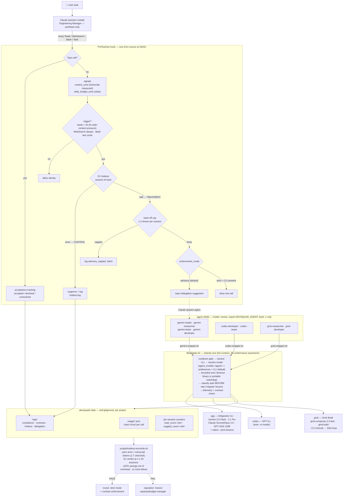

# DevSquad Architecture

One page for future maintainers (including future Claude sessions).

## End-to-end flow (v0.8.0)



## Layers

```
Claude Code session
  │
  ├─ hooks (plugin/hooks/)           SessionStart · PreToolUse · PreCompact · Stop
  │    └─ scripts source lib/        advisory suggestions, zones, holdout, telemetry
  │
  ├─ agents (plugin/agents/)         6+2 thin Claude shells (model: sonnet)
  │    └─ Bash: bash -c 'export DEVSQUAD_AGENT=<name>; source <wrapper>; invoke_<cli> ...'
  │
  ├─ wrappers (plugin/lib/*-wrapper.sh)   THIN per-CLI configuration only:
  │    gemini-wrapper  → agy / antigravity   (Antigravity; legacy gemini CLI is dead)
  │    codex-wrapper   → codex exec          (OpenAI)
  │    grok-wrapper    → grok                (xAI Grok Build)
  │
  └─ adapter (plugin/lib/adapter.sh)  the SHARED invocation core (decision D4):
       cooldown gate → CLI resolve → model resolve → args → bounded execution
       (timeout binary or portable watchdog) → classification (auth BEFORE
       rate) → telemetry → contract logging → stdout
```

Support libs: `state.sh` (state/config/cooldowns), `usage.sh` (usage records,
zones, capacity, contract checks), `enforcement.sh` (mode, compliance logging,
per-session counters), `routing.sh` (static keyword table — see
ROUTING-CHANGELOG.md), `cli-detect.sh` (detection + PATH bootstraps).

## The wrapper contract

Enforced by `test/test_wrapper_contract.sh` (offline, fake CLI binaries):

- `invoke_<cli>(prompt, limit, timeout)` → response on stdout, exit 0
- failure → exit 1, stderr prefixed `RATE_LIMITED|AUTH_ERROR|TIMEOUT|CLI_ERROR`
- every call recorded in `usage/<agent>.json` + `state.json` stats;
  successes checked against word/line bounds into `logs/contracts.log`
- auth classified BEFORE rate (the "mig**rate**" lesson)
- every call time-bounded, even without a `timeout` binary

## Adding a 4th CLI

1. Copy the shape of `grok-wrapper.sh` (~80 lines): PATH bootstrap if needed,
   `_resolve_<cli>_model`, `_<cli>_configure_adapter` (agent key, hints,
   `_adapter_resolve_cli`, `_adapter_build_args`), `invoke_<cli>` (limit
   resolution + bound + `_adapter_invoke`).
2. Add the CLI to the contract test's wrapper list and fake-binary loop.
3. Agents in `plugin/agents/`, routing branches in `routing.sh`,
   `default_routes` value validation in `update-config.sh`, detection in
   `cli-detect.sh` + `session-start.sh` + `show-status.sh`, stats key in
   `state.sh`, summary block in `usage.sh`.
4. Dated entry in ROUTING-CHANGELOG.md. Defaults change only with evidence.

## Deployment modes (the drift trap)

- **User mode**: `install.sh` registers global hooks pointing at the
  marketplace clone (`~/.claude/plugins/marketplaces/devsquad-marketplace/plugin`).
  Refresh with `claude plugin marketplace update devsquad-marketplace` +
  `claude plugin update devsquad@devsquad-marketplace` after each release.
- **Dev mode** (this machine): global hooks point at the source checkout, so
  hooks run at HEAD. Agents/commands/skills STILL load from the installed
  plugin — after pushing, update the plugin or subagents run stale code.
- Never let hook commands reference a versioned cache dir
  (`plugins/cache/.../<version>/`): that froze production at 0.3.0 for
  five months while fixes accumulated unreleased.

## State (per project, `.devsquad/`, self-gitignored)

`config.json` (enforcement_mode, default_routes, preferences, agent_models,
holdout_mode) · `state.json` (session zones, stats, last_suggestion) ·
`usage/*.json` (per-agent char records) · `logs/` (delegation, compliance,
contracts, holdout) · `read_count.<sid>` / `suggest_count.<sid>` (per-session
counters) · `cooldown_<agent>` (rate-limit cooldowns) · `capacity.json`
(user-reported CLI usage).

## Tests

`bash test/run.sh` — no network, no real CLIs, bash-3 compatible, jq-less
paths exercised. Files: hooks (fixtures through pre-tool-use.sh), routing
(table-driven route_task), models (resolution precedence), wrapper contract
(fake-binary conformance). The suite has caught real latent bugs on first
run twice (`write_state`, `record_rate_limit` — both missing-dir crashes);
run it before every commit.
