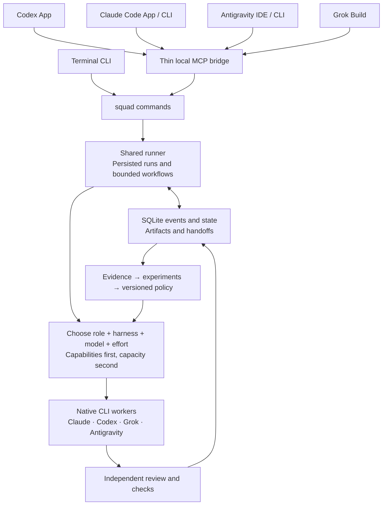
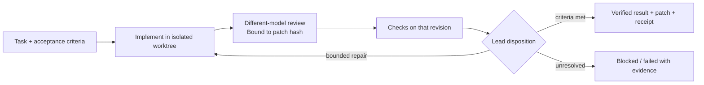
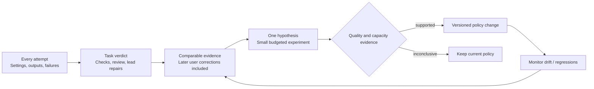

# ADR-002: One engineering team, accessible from every local surface

- **Date:** 2026-09-06
- **Status:** Implementation design prepared from Dikshant's brief. The architecture and backlog are ready for a coding agent; the runtime described here is **not implemented**.
- **Scope:** One user, one machine, multiple repositories, multiple local AI applications and subscription CLIs.
- **Basis:** [Repository and GitHub assessment](../audits/2026-09-06-engineering-team-assessment.md), source at `c7f5930`, and the user's subsequent requirements for model/effort selection, capacity, learning, documentation and surface independence.
- **Execution entry:** [START-HERE](../plans/engineering-team/START-HERE.md).

## Decision in one picture



**The product is an engineering team with shared memory and verifiable work.** A provider's distinctive information access is one capability among coding, diagnosis, design, testing, review, tool use and synthesis. Roles stay stable; assignments change with evidence.

Optimize accepted outcomes first, then reduce rework, latency and scarce allowance. Do not maximize the number of models involved, equalize provider use, or assume that more reasoning effort improves every task.

## What remains and what changes

[ADR-001](ADR-001-contract-and-ledger-core.md) remains the historical July decision. This design retains its packaged core inside `plugin/`, reusable adapters, bounded invocation, explicit capabilities, static initial routing and evidence requirements. For this proposed build it replaces these parts:

| July design | September implementation decision |
|---|---|
| Bash-only coordinator | Python 3.11+ standard-library coordinator; preserve Bash 3.2 adapter compatibility and use verified native protocols where available |
| JSONL as primary ledger | Transactional SQLite event ledger and projections; JSONL is an export |
| Claude session always synthesizes | One explicitly selected lead: current host or a headless worker |
| Provider/role aliases and implicit self fallback | Exact execution profiles; qualified fallback or an explicit blocked state |
| Three-provider demonstration | Useful branch review first; two-harness delivery workflow next |
| D1 determines the platform's future | D1 evaluates hook enforcement only; engineering outcomes evaluate the team |
| Timing/volume threshold as learning prerequisite | Begin manual evidence-based improvements immediately; defer automatic learned routing |

This does not retroactively mark new decisions as accepted in July. Old product descriptions and historical measurements are not evidence that the new runtime exists.

## Runtime and packaging

Add a small Python package inside `plugin/core/`. Its standard library provides JSON validation logic, SQLite, subprocess control and the CLI. Use the official Python MCP SDK as an **optional**, pinned dependency for the MCP bridge; ordinary CLI operations must work without it. Resolve and test the precise SDK version during implementation.

```text
plugin/core/
  bin/squad                  stable command entry
  pyproject.toml             Python floor and optional MCP dependency
  src/devsquad/
    cli.py, contracts.py     one service API for CLI and MCP
    store.py, supervisor.py  transactions, ownership, process lifecycle
    workflows.py, router.py  two fixed workflows, profile selection
    adapters.py, capacity.py provider bridge and account pools
    learning.py, reports.py  observations, evaluations, derived docs
    mcp_server.py            short tool calls; no separate business logic
  schemas/                  versioned public JSON contracts
  adapters/                 manifests and Bash bridge to existing wrappers
  policies/                 starter policy and reusable role prompts
  integrations/             minimal instructions/config templates per host
test/core/                  offline unit, process and integration tests
```

Use one local database, `~/.devsquad/runtime/state.sqlite3`, on local storage with WAL and schema migrations. Repository identity comes from the canonical Git common directory; worktrees share an identity. Store runs below `~/.devsquad/runtime/projects/<project_id>/runs/<run_id>/`. Runtime data stays outside Git. Versioned project policy lives in a new `devsquad/` directory, avoiding the existing ignored `.devsquad/` legacy state.

The initial runtime needs no web server, queue service or permanent daemon. `squad start` persists a request, starts one detached supervisor per run and immediately returns its ID. Supervisors own native CLI subprocess groups. Any local surface can inspect, cancel or resume the same run. Closing an app or its MCP connection does not cancel a run.

A standalone install exposes `~/.local/bin/squad` through a stable launcher to an immutable release directory under `~/.devsquad/releases/`. Plugin and standalone packages use the same core. Running jobs pin their release path and digest. An explicit development install may target the source checkout, with a dirty-source fingerprint. `doctor` reports installation drift. No runtime path should require an active Claude session or a versioned Claude cache path.

## Surfaces are clients, not separate orchestrators

| Surface | Integration | Boundary |
|---|---|---|
| Terminal | `squad` directly | Can use a supplied task and a headless lead |
| Codex desktop / CLI / IDE | Local stdio MCP | Local Codex surfaces share MCP configuration on the same host [1] |
| Claude Code desktop, Code tab / CLI | Local stdio MCP | Use shared user/project MCP configuration; local Code sessions have the relevant CLI integration [2] |
| Antigravity IDE / CLI | Local stdio MCP | Verify installed version against documented settings; configure one DevSquad server [3] |
| Grok Build | Local stdio MCP | Detect inherited Claude/project registrations before adding another [4] |

V1 supports these **local** surfaces on the same machine. Cloud sessions need a later authenticated remote transport; a local stdio server does not make the Mac remotely reachable. Private chat history, hidden reasoning and host-specific tools do not transfer. Task specifications, files, results, decisions and handoff packets do.

MCP exposes ordinary short `start/status/events/result/cancel/resume/handoff` operations. Do not depend on every host supporting MCP's optional long-running-task extension. Host-specific instructions explain when to use these operations; they must not contain their own router or provider matrix.

## One lead, bounded workers

The host supplies a structured task with acceptance criteria. In `lead.mode=host`, the current app is the lead and the runner executes a fixed workflow. When a decision is needed, the run becomes `awaiting_host` with a saved packet. Another surface can claim that handoff using a fenced ownership token.

In `lead.mode=headless`, a selected CLI profile performs the same synthesis/disposition step. The core does not start an additional planner. V1 accepts structured tasks and two fixed workflow templates; natural-language planning and arbitrary workflow DAGs can come later.



Start with the smaller `branch-review` template: snapshot → review → checks → disposition → receipt. Add `issue-delivery` after this is useful. Repository changes occur in an isolated worktree with one writer. Reviewers have verified read-only permissions and a frozen revision. Checks use trusted argv arrays. Patch changes invalidate prior review/test acceptance. V1 returns work for integration; it does not merge, push, deploy or publish automatically.

Preserve the existing shell wrapper API and four error prefixes. Extract shared argument-building/classification helpers for CLI adapters; prefer a verified native app-server adapter for new Codex jobs. Python owns the protocol child or CLI subprocess, timeouts, cancellation, draining and reaping; the legacy wrapper keeps its separately repaired bounded invocation path. Do not nest competing watchdogs or two job coordinators. The [native adapter amendment](../plans/engineering-team/MODEL-LIFECYCLE-AND-NATIVE-ADAPTERS.md) records the source-backed extension.

## Select configurations, measure outcomes

An execution profile is `(harness, harness version, model family, exact model, effort, tools, permissions, account pool)`. Antigravity may expose several model families: the harness name alone does not identify the model. Every attempt records requested settings, observed settings and verification confidence. Native X, Google Search or YouTube access must be verified for the **selected harness/model/tool combination**; model branding or training history is insufficient.

Routing starts with a small versioned preference list per role/task class. Filter for capability, permission, quality eligibility and verified model/effort support. Then consider every applicable quota window, cooldown, concurrency, deadline and latency. If no eligible profile is available, block with a reason. Never silently relax required capabilities or switch to paid API usage.

Selection is automatic by default. A user may pin a validated profile for any role; unpinned roles remain automatic. The selected profile defines the permitted toolbox, and the worker selects actual tool calls within it. Overrides have explicit fallback behavior. Stable role aliases resolve to qualified concrete profiles and are frozen per run. Discovery/evaluation can propose replacements; a reviewed update policy may authorize guarded automatic binding promotions, while policy changes remain reviewed. See the [selection amendment](../plans/engineering-team/SELECTION-AND-COUNCIL.md) and [model lifecycle](../plans/engineering-team/MODEL-LIFECYCLE-AND-NATIVE-ADAPTERS.md).

Account pools span applications and repositories where the underlying allowance is shared. Provider observations have sources and expiry times; unknown allowance is unknown. DevSquad's concurrency reservations do not reserve quota with a provider. Spend estimates, token counts, characters and subscription allowance are distinct measurements.

## Learning and documentation are part of completion



Use two loops: bounded corrections inside the current task, and deliberate policy improvement across tasks. Initial profile preferences are hypotheses, not a provider leaderboard. Retain failed attempts, fallbacks and lead rework; a repaired final success must not become an unqualified success for the original worker. Hold out evaluation tasks and avoid tuning and testing on the same answer.

Runtime records generate a receipt at every terminal state and a handoff packet when waiting. Curated `devsquad/learning/` records track `observed → hypothesis → tested → adopted/rejected → revalidate`. Policy changes link evaluations and rollback versions. Update these artifacts as work completes; a later scheduled summary can be added when requested, but no background automation is installed by this plan.

## Delivery gates

| Gate | User-visible result |
|---|---|
| M1–M2 | Reliable adapter bridge and recoverable local run; fake process tests prove the lifecycle |
| M3 | A real branch review from terminal produces an inspectable receipt |
| M4 | Start in one local app, inspect/finish in another, using the same run ID |
| M5 | Bounded issue → implementation → different-model review → checks |
| M6 | Account-pool-aware scheduling and evidence-backed profile comparisons |
| M7 | Fresh installation, documentation and real smoke receipts for all requested surfaces |

The detailed [contracts](../plans/engineering-team/CONTRACTS.md) and [work packages](../plans/engineering-team/IMPLEMENTATION.md) are normative for the build. Their gates replace claims based only on dry runs or syntax checks.

**Optional C1 after M6:** Adapt LLM Council's independent-proposal, critique and synthesis pattern for difficult decisions. Use a bounded council within this runner, with evidence-based judgement and saved dissent. It does not delay M7 or replace routine implementation/review/checks. The [source study and extension gate](../plans/engineering-team/SELECTION-AND-COUNCIL.md) explain the protocol and capacity tradeoff; automatic council triggering requires evaluation evidence.

## Source notes

Product integration documentation checked on 2026-09-06; recheck at installation because paths and host versions change.

1. [Codex MCP configuration](https://learn.chatgpt.com/docs/extend/mcp?surface=cli).
2. [Claude Code desktop](https://code.claude.com/docs/en/desktop).
3. [Antigravity MCP](https://antigravity.google/docs/mcp) and [CLI MCP](https://antigravity.google/docs/cli/mcp/).
4. [Grok Build MCP servers](https://docs.x.ai/build/features/mcp-servers).
5. [Official MCP Python SDK](https://github.com/modelcontextprotocol/python-sdk) and [optional MCP Tasks](https://modelcontextprotocol.io/extensions/tasks/overview).
