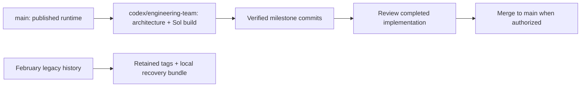

# Branch consolidation — September 6, 2026

The repository now has two working branches, with matching names locally and on GitHub. Runtime implementation is still pending; branch cleanup does not complete any implementation milestone.



## Canonical branches

| Branch | Purpose | Starting evidence |
|---|---|---|
| `main` | Published runtime baseline; tracks `origin/main` | `fa68f68621dcad166ab24cf4b3db379ecbe819ac` |
| `codex/engineering-team` | Complete architecture, execution prompt and subsequent Sol implementation | Contains all five design commits through `ff1fa602d546c9b19c50ae32fc00d7066a7aaf10`, followed by this cleanup record |

Use [SOL-HANDOFF.md](../plans/engineering-team/SOL-HANDOFF.md) as the full build assignment. Start on the build branch or a worktree based on it. Before implementation, require a clean tree and `git merge-base --is-ancestor ff1fa60 HEAD` to succeed. GitHub's default branch remains `main`, so a default-branch checkout alone does not contain the plan.

## What was sorted

| Previous branch | Finding | Disposition |
|---|---|---|
| `codex/surface-independent-team-plan` | Latest complete plan and handoff, five commits ahead of `main` | Renamed to `codex/engineering-team`, published with upstream tracking |
| `codex/engineering-team-assessment` | `c7f5930`, already contained in the plan branch | Redundant local branch removed; commit retained in build history |
| `holdout-protocol` | `044dd75`, fully merged; `main` is 20 commits ahead and zero behind | Redundant local and GitHub branches removed; commit retained in `main` |
| `backup-bug-fixes` | `f6d9c4c`, 85 commits in unrelated February history, no merge base with current `main` | Branch removed after verified complete backup; existing local tag `v0.1.1-bug-fixes` retains the exact tip |

The old bug-fix lineage was reviewed by Sol before implementation. Its meaningful fixes were ported by `b70fc22`, an ancestor of current `main`, and subsequently evolved in the current plugin. Do not cherry-pick the old production snapshot: its duplicated packaging and older wrappers would regress the present structure. Historical audit documents remain accessible through the tag.

Existing tags `v0.1.1-bug-fixes`, `v1.0` and `v1.1` were retained unchanged. Only `v1.0` was already on GitHub; the two local historical tags and recovery bundle remain local. Cleanup does not create a release or publish the separate legacy history.

## Recovery

A complete, verified Git bundle was created before any branch deletion:

```text
~/.codex/backups/devsquad/2026-09-06-before-branch-cleanup-ff1fa60.bundle
```

The bundle preserves all original branch refs, tags and reachable history. It is outside the repository and is not a cloud backup. Restore an old branch only when actually needed:

```bash
git branch backup-bug-fixes v0.1.1-bug-fixes
git branch holdout-protocol 044dd75
git branch codex/engineering-team-assessment c7f5930
```

If local tags are unavailable, recover the legacy branch from the bundle:

```bash
git fetch "$HOME/.codex/backups/devsquad/2026-09-06-before-branch-cleanup-ff1fa60.bundle" refs/heads/backup-bug-fixes:refs/heads/backup-bug-fixes
```

## Ongoing branch discipline

Keep milestone checkpoints on `codex/engineering-team`. Use separate worktrees only for concurrent work, then integrate their verified commits and remove their temporary branch refs/worktrees. Preserve unique work before removal. Keep `main` as the reviewed baseline and merge the completed build only when authorized. Fetch/prune before branch cleanup; check ancestry rather than interpreting a branch name or date as proof that it is obsolete.

The cleanup audit found one working tree, no stashes, no open or historical GitHub pull requests, and no remote changes after fetching. Validation includes ancestry checks, complete bundle verification, the existing offline test suite, clean working-tree checks and exact local/GitHub branch-tip comparison. These checks establish repository hygiene; they do not establish that the planned engineering-team runtime works.
