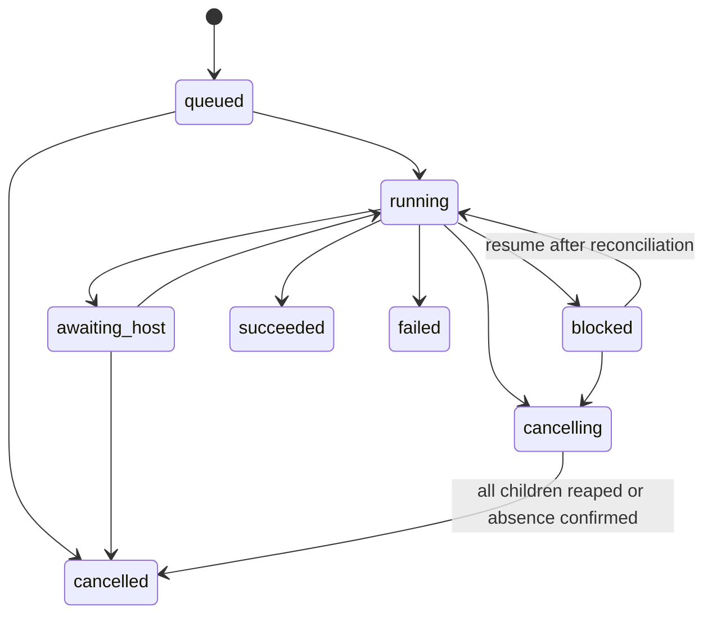

# Engineering-team contracts v1

**Design contract, not an existing CLI reference.** These contracts implement [ADR-002](../../adr/ADR-002-surface-independent-engineering-team.md). M1 creates schemas; later milestones add the operations below without changing their meanings. Examples are deliberately fictional fixtures.

## 1. Public operations

All machine responses use `{schema_version: 1, ok: boolean, data: object|null, error: object|null}`. Exactly one of `data` and `error` is non-null. Errors contain `code`, `message`, `retryable` and structured `details`. JSON output contains no progress prose; stderr is for diagnostics. MCP invokes the same application functions as the CLI, without shelling out to string commands.

| CLI | MCP tool | Effect |
|---|---|---|
| `squad doctor --json` | `squad_doctor` | Versions, capabilities, permissions, registration/install drift; metadata only |
| `squad start --task-file FILE --idempotency-key KEY [--supersedes-run RUN] --json` | `squad_start` | Validate, snapshot and persist; return run ID promptly |
| `squad status RUN --json` | `squad_status` | State, version, active steps, blockers, usage observations and next action |
| `squad events RUN --after CURSOR --limit N --json` | `squad_events` | Bounded event page and next cursor; no provider reasoning stream |
| `squad result RUN --json` | `squad_result` | Receipt and artifact references; `ready:false` before terminal state |
| `squad cancel RUN --json` | `squad_cancel` | Persist cancellation intent; return before termination finishes |
| `squad resume RUN [--recovery-file FILE] --json` | `squad_resume` | Reconcile ownership and effects; resume only if safe |
| `squad handoff claim RUN --expected-version N --owner OWNER [--claim-file FILE] --json` | `squad_handoff_claim` | Obtain or renew fenced host claim and input packet |
| `squad handoff complete RUN --claim-file FILE --decision-file FILE --json` | `squad_handoff_complete` | Submit disposition with current claim and evidence |

MCP accepts parsed task/recovery/decision/claim objects instead of CLI file arguments, and optional `supersedes_run_id` on start. Bind request origin to the calling integration where possible; a user-supplied host label is provenance, not an authentication boundary. Local server operates as the same OS user. No network listener in v1.

The MCP server entry is `squad mcp serve` over stdio. Its stdout is exclusively MCP transport traffic; logs go to stderr. Missing optional MCP dependencies produce actionable install guidance without preventing ordinary CLI use.

`start --wait` is a CLI convenience using the same saved run. Ctrl-C exits observation without cancelling; print the run ID and explicit cancel command. Non-waiting accepted operations exit 0; invalid input exits 64; ownership/version conflict exits 75; runtime/internal failure exits 1. `--wait` exits 0 for `succeeded`, 2 for `blocked`/`awaiting_host`, 3 for `failed`, 4 for `cancelled`. `doctor` exits 1 when required readiness checks fail. A successfully retrieved failed run still gives `status` exit 0.

Later M6 CLI additions: `capacity observe --file FILE`, `outcome add RUN --file FILE`, `report --project PATH`, `learn propose --project PATH`, `policy evaluate --experiment FILE`. These use the same envelope. Read-only reporting never modifies the active policy.

Core operations are idempotent where specified, not “exactly once” execution of external effects. Reusing `(project_id, idempotency_key)` with an identical canonical request returns the original run; a different request hash returns `CONFLICT`. Retransmitted cancellations do not spawn another cleanup process. A repeated successful handoff completion returns its existing result if the submission hash matches; conflicting late completion is rejected and retained as an audit event.

Hash the canonical **submitted** request, including an optional predecessor ID, before resolving moving refs or loading mutable policy contents. After structural validation and project identification, claim the key transactionally in a non-runnable `queued` record with `phase: preparing`. Only the owning preflight completes the immutable snapshots and enables execution. A replay returns that record without resolving refs again; concurrent preflights cannot overwrite it. A crash during preflight is recoverable under the same claim discipline. Syntax-invalid requests create no run; post-claim validation failures produce a failed receipt. `start` may return a preparing run while bounded preflight proceeds; it never waits for a provider call.

## 2. Task and policy inputs

The Task schema rejects unknown fields and checks finite bounds. It contains:

| Field | Required meaning |
|---|---|
| `schema_version` | Integer `1` |
| `project.repo_path` | Existing absolute Git repository path, registered using canonical common directory |
| `project.base_ref`, `project.target_ref` | Resolve to immutable commit OIDs before launch; review compares base→target, delivery starts at target |
| `workflow` | `branch-review` or `issue-delivery`; no arbitrary shell/DAG step types |
| `goal`, `task_class` | Bounded objective and comparison class, e.g. `bugfix-python-small` |
| `acceptance[]` | Stable criterion `id`, concrete `description`, `evidence_kind` (`review`, `check`, `artifact`, `host`) |
| `checks[]` | `id`, `argv` string array, repository-relative `cwd`, `timeout_seconds`, `required_to_pass` |
| `scope` | Repository-relative `read_paths`, `write_paths`; non-empty writes only for delivery |
| `lead` | `mode: host` or `headless`; headless requires candidate profiles in policy |
| `routing` | `profiles_file`, `policy_file`; absolute or repository-relative trusted config files |
| `budget` | `wall_seconds` of active run execution, `max_provider_calls`, `max_revisions`, `max_fallbacks_per_step`; all finite non-negative integers, wall/calls positive |
| `origin` | `surface` label, optional `session_ref`; no authorization or remote invocation implied |

Snapshot the task, resolved refs, config files and their hashes before enqueue. Do not resolve a moving branch again halfway through a run. V1 uses committed inputs only: if dirty files intersect declared scope, reject with an actionable `INPUT_INVALID` rather than silently omitting them. Explicit dirty-worktree snapshot support is deferred. Validate paths against traversal and symlink escape. Task checks and policies are execution authority: repo content and provider output cannot add commands or widen permissions.

The CLI must print the resolved scope/check plan in validation output; an app lead should supply it from the user's actual task. No magic inference from a README's embedded instructions. Checks may legitimately have side effects; run them in the isolated workspace with the declared process policy. “Read-only reviewer” does not mean executing arbitrary repository scripts is safe to treat as read-only.

`Policy` contains an `id`, `version`, workflow role candidate lists, per-task-class minimum quality status, `require_different_model_for_review`, optional `prefer_different_harness_for_review`, account-pool policy and experiment budget. V1 role names are `implementer`, `reviewer`, `lead`; checks are deterministic process steps, not model calls. Add a `researcher` role only when a workflow needs specific research artifacts. Don't make every task pay for research or a council.

`Profile` contains:

```text
id; harness; model_family; model_id; effort {value, transport};
required_tools[]; permission_policy; account_pool_id; billing_mode;
quality_status; evidence_refs[]
```

`effort.transport` is `native`, `model_variant`, or `provider_default`. Values are native to that harness/model; never translate “high” into a numeric equivalent across vendors. Unsupported explicit effort fails validation. Provider default may be allowed, but its effective value remains unknown unless reported. `quality_status` is `unvalidated`, `trial`, `proven` or `suspended`, scoped to task class by policy evidence. Trial profiles are eligible only in explicitly permitted classes. Exact family and model IDs are mandatory for cross-model independence claims; inability to verify identity blocks that claim.

Install-time discovery reports supported values and evidence (`documented`, `probed`, `unavailable`, `unknown`) with `checked_at`, CLI version and toolset hash. Selecting a known catalog entry verifies that it exists, not that the invocation used it: attempts retain separate `requested` and `observed` fields. Manually verified mappings may establish identity for a versioned harness; silent model fallback must never be labelled confirmed.

## 3. Adapter execution boundary

Retain `invoke_codex`, `invoke_gemini`, `invoke_grok` and their legacy stdout/exit/error contract. Add a Claude headless adapter. New execution uses a bridge around shared wrapper configuration and classification helpers:

1. `prepare(request.json)` returns `LaunchSpec`: fixed manifest-selected executable, argv array, working directory, optional stdin artifact, allowlisted environment overrides, requested model/effort, parser version, permission evidence. The bridge may source bundled wrapper functions; it must not source a request-selected file.
2. Python launches that argv directly in a new process session/group, with no `shell=True` or `eval`, owns lifecycle and captures bounded stdout/stderr to files.
3. `classify(exit_code, stdout_file, stderr_file, timed_out)` returns the legacy-compatible error class or execution completion plus native model/usage/session metadata. Extract shared logic rather than implementing two independent classifiers. A Bash argv builder can send NUL-separated arguments to a bundled Python serializer; never interpolate JSON strings into shell code.

The new bridge does not call `_adapter_invoke`'s watchdog or write legacy JSON usage arrays. Python writes new-run telemetry once. Existing sourced callers retain their old bookkeeping. Per-run model/effort/permission overrides must not edit shared configuration. Native CLI timeouts may act as an earlier provider limit, but Python remains the sole supervisor and cleanup owner.

The four adapter error codes stay `RATE_LIMITED | AUTH_ERROR | TIMEOUT | CLI_ERROR`, with auth checked before rate. Additional **core** errors include `INPUT_INVALID`, `PROFILE_UNSUPPORTED`, `CAPABILITY_UNAVAILABLE`, `CONFLICT`, `RECOVERY_REQUIRED`, `BUDGET_EXHAUSTED`, `POLICY_DENIED`, `INTERNAL_ERROR`. Do not expand the legacy prefix enum to represent orchestration states.

Execution completion is separate from deliverable validity and acceptance. Empty output, malformed required JSON, tool/permission denial or an authentication banner can invalidate a nominal exit-0 invocation. Save raw native output and the parser verdict. Prompt compliance alone does not prove a reviewer was read-only: require a verified native restriction or OS process policy; otherwise that role is unavailable. Do not use the wrappers' current blanket approval flags in new worker profiles.

Use Git's tracked-file inventory and explicit task scope for context. Preserve filenames with spaces, TSX/JSX and other tracked extensions. Bound bytes and document exclusions; never silently truncate required evidence. Exclude runtime state, secrets and ignored files by default; an explicitly required ignored input needs an intentional input artifact. Large context should use native scoped filesystem access when supported rather than concatenating every file.

Workers get `DEVSQUAD_WORKER=1`, run/attempt IDs and a delegation-depth guard. DevSquad's worker-facing MCP tools reject new team starts and workflow mutations, and legacy hooks honor the guard. Native authentication remains available through the provider's normal mechanism, but credentials and environment contents are not logged. Do not assume prompt text alone stops recursive delegation.

## 4. Durable state, concurrency and recovery

SQLite schema has `projects`, `runs`, `steps`, `attempts`, `events`, `artifacts`, `claims`, `pool_observations`, `pool_reservations`, `outcomes` and `schema_migrations`. Entity IDs are opaque UUIDs; event cursors, versions, fencing tokens and migration versions are integers. UTC timestamps accompany durations measured with a monotonic clock. Mutations increment a run `version`; the append-only event and affected projections commit together in one short transaction. File artifacts are atomically finalized and hashed before a transaction references them; crash-created unreferenced files are recoverable garbage, not valid results.



Terminal states are `succeeded`, `failed`, `cancelled`; they are immutable. Retrying a terminal run uses `start --supersedes-run RUN` with a new idempotency key and a supplied task. Validate the predecessor is terminal and belongs to the same project; persist the link and resnapshot the new request. Terminal `resume` returns `CONFLICT` with this next action; it never creates a run. `blocked` has a typed reason and next action. A crash-recovery scan reconciles stuck `running` jobs. Event cursors are monotonically increasing database IDs, filtered per run (gaps are normal), with bounded pages. Preflight may transition `queued` directly to `failed`; cancellation of a queued preflight must fence its late snapshot completion.

Enforce one active writer attempt per worktree and one supervisor claim per run transactionally. Store PID, process-group ID, process-start identity, heartbeat, attempt token and package digest. Lease expiry alone never licenses a replacement writer. On lost supervisor, inspect the child identity, pending writes and last artifact boundary. A live child remains owned; observation may reattach without relaunch. Ambiguous identity returns `RECOVERY_REQUIRED`; do not kill a reused PID.

Cancel: persist intent → signal the verified process group → drain output → bounded grace (default five seconds) → kill if needed → reap/confirm absence → record terminal state. Total run and per-step deadlines include retries. Keep `cancelling` with diagnostic evidence if termination cannot be confirmed; no competing writer may start. Native detached remote effects outside this process group are a separate adapter limitation: unsupported tools cannot be advertised as safely cancellable.

`budget.wall_seconds` counts elapsed active execution, including preflight, checks, retries and cleanup; parallel steps consume wall time once per run. It pauses in idle `queued` (excluding active preflight), `awaiting_host` and `blocked` only after all worker processes are stopped and ownership reconciled. Host thinking and quota waiting can therefore continue overnight without consuming execution allowance; record them separately as waiting/total elapsed time. Exhaustion stops work, performs bounded cleanup and ends `failed` with `BUDGET_EXHAUSTED`; cleanup may exceed the budget only to enforce safe termination. A lost heartbeat never pauses the clock while a child may still be running.

Resume distinguishes (a) live work, (b) a verified resumable native session, and (c) interrupted work needing a new attempt. Native session IDs are only used if the installed adapter has a tested resume capability. Default interrupted writers need a recovery disposition referencing attempt ID, current workspace/patch hash, known effects and chosen checkpoint. Validate this evidence before creating the next attempt. A retry must not blindly repeat external effects. V1 worker policies disable publish/deploy and other irreversible remote actions.

Host handoff claims use a bounded lease and increasing fencing token. `claim` needs the expected run version; `complete` needs the current token, handoff ID, submission ID/hash and evidence refs. An expired host can no longer advance the run. Save its late submission for audit without applying it. `accept`, `revise`, `reject` are the allowed dispositions. Acceptance cannot override a failed mandatory check, stale revision, exhausted correction budget or missing independent review.

Default host lease is ten minutes. A competing claim while a live claim exists returns `CONFLICT`; no implicit takeover. The current owner renews with `claim` plus its claim object and current expected version before expiry. Renewal extends the same fencing token; after expiry a successful new claim increments the token, even for the same owner label. Claim responses contain handoff ID, token, expiry and run version. Cancellation invalidates claims. This lease governs permission to submit a decision, not the lifetime of the saved handoff.

## 5. Workflows and acceptance

| Template | Ordered steps | Completion |
|---|---|---|
| `branch-review` | Resolve base/target → frozen review workspace → reviewer → configured checks → lead disposition | Valid review artifact, evidence for each criterion, recorded check outcomes, accepted disposition |
| `issue-delivery` | Snapshot target → implementer → frozen candidate → different-model reviewer → checks → lead disposition | Candidate meets all criteria, independent review complete, mandatory checks pass |

For review-only tasks a check may have `required_to_pass:false`: a failing test then becomes a finding in a successfully delivered review. Delivery's required checks must pass. Mark these policies before execution. A valid critical finding is a useful reviewer contribution, not automatically a failed reviewer attempt.

For `issue-delivery`, `revise` loops back to implementation. For `branch-review`, it requests a corrected review of the same frozen diff; it never authorizes source edits. Both consume one revision allowance and require a reason. With no allowance remaining, a revise request ends the run failed with `BUDGET_EXHAUSTED` after cleanup. Each role may attempt bounded fallbacks; permission/capability restrictions carry across them. Nonrecoverable step failure blocks dependent steps. No continuing into acceptance after missing implementation or invalid review. A headless lead's invalid disposition is a failed attempt, not permission to invent success; changing lead mode requires a new explicitly supplied task/run in v1.

Bind artifacts, findings, tests, dispositions and criteria to a candidate tree/patch hash and resolved baseline. Freeze an implementation candidate into a local run-owned commit before review; reject changes outside scope and capture untracked permitted outputs intentionally. Run checks in a separate candidate worktree so test-generated files cannot alter the reviewed candidate. If a check must change source, that creates a new candidate needing new review. A subsequent code change invalidates affected evidence and triggers review/checks again. Run results contain a patch/commit reference and integration instructions; the coordinator does not alter the user's current checkout.

Every attempt receipt includes role, parent step, profile/policy/prompt/schema versions, requested/observed model/effort, tools/permissions, runtime version, input/output hashes, process verdict, artifact verdict, latency, usage by source and error. The run receipt also includes criteria results, all attempt IDs, fallbacks, revisions, lead repairs, final disposition and remaining limitations. Host work is recorded as externally observed with unknown usage where unmeasured; do not omit it or estimate it as zero.

## 6. Capacity without false precision

Model providers, execution harnesses and billing accounts are separate identities. `account_pool_id` is a user-configured opaque identifier; no credentials. A pool may contain multiple windows and model-family sublimits. Unknown mapping is explicitly unresolved; do not assume two apps give two independent allowances or that every model within an account shares one limit.

Observation fields: `pool_id`, `window_id`, `applies_to`, `observed_at`, `expires_at`, `source`, `used`, `limit`, `unit`, `resets_at`, `confidence`. Unknown measurements are null. Sources distinguish native reported values, manual reports and estimates. Percent observations retain their native unit; do not convert characters or token estimates into subscription percentage. Validate bounds and clock skew. Ignore stale observations for hard capacity decisions, while showing their last-known values.

Route order:

1. Capability, permissions, model/effort support and task-class quality eligibility.
2. All applicable fresh quota windows, auth failure, known cooldown and local in-flight concurrency/reserve constraints.
3. Versioned candidate preference, deadline and measured latency; log exclusions and selection rationale.

An explicit `unknown_capacity_policy` is `allow_bounded` or `block`; default `allow_bounded` permits one short trial/in-flight job per unresolved pool, with normal per-run budgets, and labels uncertainty. A fresh known exhausted window blocks all affected profiles. Reset timestamps permit a refresh/reconsideration; they do not prove fresh availability. Auth errors require observed repair; rate errors use provider retry/reset metadata or conservative recorded cooldown. Never loop until a provider happens to recover.

Local reservations are concurrency/scheduling records, not provider quota guarantees. Other apps can consume the allowance during a run. An account-level usage delta is not assigned wholesale to one task. Record per-call usage only when the provider identifies it, and preserve uncertainty. Billing mode is `subscription` or `paid_api`; policy must explicitly permit paid API profiles before selection. A subscription's marginal cash price is not its opportunity cost.

## 7. Learning, evaluation and ongoing docs

Run completion writes local `receipt.json`, `receipt.md`, `events.jsonl` export and an artifact manifest, including failures/cancellation. Waiting writes `handoff.json` and `handoff.md`. Raw outputs stay local. Tracked distilled records use:

```text
devsquad/
  profiles.json, policy.json              versioned intended configuration
  learning/observations/<id>.md           outcome + provenance + later correction
  learning/experiments/<id>.json          question, comparison, budget, stop rule
  learning/evaluations/<id>.md            cases, failures, uncertainty, verdict
  learning/decisions/<id>.md              adopt/reject/no-change + rollback target
  learning/policy-changelog.md            links to evidence and policy diffs
```

`report` derives summaries from the database; `learn propose` writes draft distilled records for review. It does not change routing. Raw task content is not automatically committed or uploaded. Track redacted evidence with reproducible case IDs/hashes and an explicit `evidence_availability` value (`local`, `tracked_fixture`, `unavailable`); a local path alone is not portable proof. Policy promotion requires a reviewed, versioned change with evaluation links. During M6 use an ordinary Git diff/review for this, not another bespoke approval UI.

Use this loop:

1. Define task class, criteria and intended comparison before execution.
2. Record every attempt, including failure, fallback, reviewer contribution and lead repair. Attach later corrections/escaped defects via `outcome add`; append revisions to verdicts, never erase the original.
3. Propose one change: model, effort, prompt/context strategy, tool access or workflow. Compare like tasks and keep the remaining settings controlled or explicitly record confounders.
4. Run a small predeclared evaluation with held-out cases, budget and stopping rule. Avoid routing only hard tasks to one model and then treating unadjusted averages as model quality.
5. Promote only with supported quality evidence, acceptable rework/latency/capacity tradeoff and a rollback target; otherwise preserve the policy and record no-change.
6. Revalidate affected profiles after model/harness/prompt/tool/policy drift or escaped defects. Do not discard unrelated evidence or automatically promote a newly released model.

Default experiment budget is disabled until explicitly configured, then at most 10% of eligible runs with a hard call/time cap. Most work uses the current proven policy. V1 uses human-governed static preferences, not exhaustive permutations, an automatic bandit or foundation-model fine-tuning. Report sample sizes and missingness; tiny samples justify hypotheses, not provider rankings.

Measure acceptance and critical defects first; also show retries, lead rework, elapsed time, measured usage by pool, blocked time and unmeasured overhead. Final task success and original worker quality are distinct. Pair deterministic checks with review and human correction; a model judging itself is not sufficient evidence.
