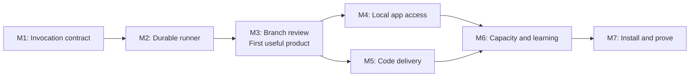

# Implementation work packages

**All milestones are pending.** This is the execution sequence for [ADR-002](../../adr/ADR-002-surface-independent-engineering-team.md) and [contracts v1](CONTRACTS.md). The existing 177 offline assertions passed during architecture preparation; they validate legacy behavior, not the proposed runtime.

## Sequence and stopping points

Implement sequentially through M3. M4 and M5 may proceed in parallel after agreeing on the frozen M3 public service API; assign separate files. M6 integrates their evidence. Each milestone can contain small reviewable commits. A milestone is complete only when its required gate has evidence; an unavailable provider or app leaves the relevant live gate open.

## M1 — Make invocation truthful and reusable

**Outcome:** A versioned profile selects a verified model/effort/permission combination, and the core can prepare/classify a call without owning a second watchdog.

**Existing files:** `plugin/lib/adapter.sh`, `codex-wrapper.sh`, `gemini-wrapper.sh`, `grok-wrapper.sh`, `model-catalog.sh`; `test/test_wrapper_contract.sh`, `test/test_models.sh`.

**New files:** `plugin/core/pyproject.toml`, `bin/squad`, `src/devsquad/{cli,contracts,adapters,codex_protocol}.py`, `schemas/`, `adapters/{codex,antigravity,grok}/`; `test/core/test_contracts.py`, `test/core/test_adapters.py` and fake executables/protocol servers.

Work in this order:

1. Establish package/import layout, Python 3.11 floor, `squad --version`, initial `doctor`, strict v1 schemas and fixture loading. Record package/source fingerprints.
2. Extract reusable argv-building and classification helpers without changing sourced-wrapper signatures or error prefixes. Implement `prepare`/`classify` for CLI transport; add the version-verified Codex stdio app-server transport and event normalization. Preserve legacy telemetry only on legacy invocations. Use upstream native-protocol patterns from the model lifecycle amendment without importing a second job coordinator.
3. Fix legacy portable-watchdog completion delay and descendant cleanup with timing/process assertions. Preserve Bash 3.2 and jq-absent legacy tests. Do not make legacy operation require installing Python.
4. Add per-call explicit model/effort/tool/permission settings; verify installed CLI mappings with help/documentation and bounded probes. Discover Codex models/efforts through app-server metadata; define stable alias/templates separately from concrete profiles. Remove cross-family numeric tier ranking from new selection; correct legacy resolution with compatibility tests. Paginated catalog refresh retains last-good data on error/incomplete responses. Catalog drift produces unknown/revalidation rather than silent identity substitution.
5. Replace the Gemini extension whitelist and whitespace splitting with scoped, bounded context enumeration. Document when native file access replaces prompt concatenation.

**Acceptance gate:** Existing suite passes. Fake immediate CLI returns promptly with a 2-second timeout (target under 1 second on normal local CI); a hanging CLI and descendant are gone by timeout plus grace. Fixtures cover empty exit-0, exit-0 auth banner, denied tool, malformed output, spaces/TSX inputs, explicit unsupported effort, unavailable capability and cross-family catalog entries. Overrides do not mutate global/project config. Doctor distinguishes supported, unverified and unavailable settings. One short read-only real adapter probe validates the chosen starting profile; save a redacted receipt and version facts.

**Boundary:** No learned routing, MCP, worktree edits or universal model catalog. Manifests for unprobed harnesses remain visibly unverified.

**Native/discovery gate:** A fake app-server exercises thread/review/turn events, explicit supported/unsupported effort and native IDs. Acknowledged start/interrupt is not reported as terminal completion. Paginated metadata assembles one complete snapshot; parse/auth/timeout failures preserve the previous snapshot. An added model becomes an unqualified candidate, and an unknown family cannot inherit capabilities from its name. Native model-list schema availability alone does not count as live entitlement or quality evidence.

## M2 — Persist jobs and own their processes

**Outcome:** Start/status/cancel/resume operate on the same saved job, including after the initiating shell exits.

**New files:** `src/devsquad/{store,supervisor}.py`, database migrations, artifact storage helpers; `test/core/test_store.py`, `test/core/test_supervisor.py`.

1. Implement SQLite ledger/projections, request hashing, schema migration and atomic artifacts under the machine-local runtime directory. Canonical Git common directory identifies a project; project state and shared account pools remain distinct.
2. Add start/status/events/result/cancel/resume service functions and CLI handlers. Persist the task before spawn; recover a crash between enqueue and spawn. Use one detached supervisor per run and fixed package snapshot.
3. Implement process-group ownership, bounded output capture, timeout/cancel/reaping, supervisor claims and a single active writer constraint. Native output goes to artifacts, not an unbounded in-memory buffer.
4. Implement recovery classification and host handoff storage/claim fencing. The public API needs these invariants before apps consume it. Expired heartbeat must not trigger blind relaunch.

**Acceptance gate:** Two concurrent identical starts return one run; same key/different body conflicts. Event/projection mutations remain consistent under concurrent writers. Kill the supervisor while its child stays alive: resume launches no second writer. Reused/ambiguous PID is not signalled. Kill between artifact write and DB commit: no false completion. Repeated cancel is harmless; cancellation waits for confirmed child cleanup. Close the launching shell and inspect the job from another shell. Apply/test a database migration against a fixture of the preceding schema; refuse a newer unsupported schema. All tests use temporary runtime directories.

**Boundary:** A fake-step harness exercises lifecycle; no claim yet that an engineering workflow works. No HTTP listener or permanent daemon.

## M3 — Ship a useful branch review

**Outcome:** `squad start` reviews a real committed diff and returns findings, check results and a receipt without modifying the user's checkout.

**New files:** `src/devsquad/{workflows,router,reports}.py`, `policies/`, role templates, branch-review schema/fixtures; `test/core/test_review_workflow.py`.

1. Implement profile/policy loading, alias binding resolution, version/hash snapshots and capability/permission/quality filters. Select automatically from a small static candidate list, with validated per-role profile overrides and explicit fallback semantics from the selection amendment. Freeze concrete profiles and fallback sets during preflight; never resolve a changed alias halfway through a run. Add basic shared-pool concurrency and typed unknown capacity now; richer observations arrive in M6.
2. Resolve commit refs and task scope; create a frozen review workspace. Reject intersecting dirty inputs rather than silently omitting them.
3. Implement reviewer → trusted checks → lead disposition, with `required_to_pass` semantics. Support host handoffs through CLI and a headless lead profile. Expose clear `awaiting_host` packets. Distinguish ordinary native review from a steerable adversarial-review prompt, recording the mode and supported controls; both remain review-only against the frozen candidate.
4. Produce receipt JSON/Markdown, events export and artifact manifest for every terminal outcome. Record unknown host usage honestly.

**Acceptance gate:** An actual branch review returns actionable findings or a supported clean verdict, against recorded base/target hashes. A report-only failed check is included in a successful review; a required failed check prevents acceptance. A denied reviewer write or missing output cannot count as a valid review. A moving branch does not change the frozen run input. A second terminal claims a saved host handoff; a late completion from the first is fenced out. Verify original checkout/index/HEAD are unchanged.

**First product stop:** At this point DevSquad is usable from terminal for a bounded job. Demonstrate it before adding more architecture.

**Selection gate:** Identical task/policy/availability snapshots produce the same automatic selection. Pin one role and verify others remain automatic. Unsupported pins fail; an unavailable pin with `fallback:none` blocks without substitution. `fallback:policy` selects only a qualified alternative. No override broadens permissions or billing authority. Receipt explains effective model, effort and toolbox; a worker can only call permitted tools. Fake fixtures exercise an explicit bounded escalation and preserve each attempt's original profile.

**Accounting gate:** `max_worker_invocations` limits adapter launches, including retries and the headless lead. Native internal model/tool turns and observed token/quota usage are separate fields; unknown stays null. A simulated worker with several native turns must not be reported as one measured model request or a fixed allowance charge.

## M4 — Use that same run from local apps

**Outcome:** Apps are interchangeable clients of the saved run.

**New files:** `src/devsquad/mcp_server.py`, `integrations/{codex,claude-code,antigravity,grok}/`, optional MCP dependency/lock, generated tool-reference docs; `test/core/test_mcp.py`.

1. Pin a currently supported official MCP Python SDK version and test it with the chosen Python floor and local runtime. Keep core CLI imports free of optional MCP dependencies.
2. Map the contract's operations directly to service functions. Paginate events, cap artifact previews and return IDs/paths/hashes. Start/cancel return promptly; app tool timeout is never the worker lifetime.
3. Add minimal host instructions: construct task/criteria, submit once with idempotency key, inspect status, claim a handoff, consume receipts. No host-specific router or copied provider matrix.
4. Create explicit setup templates for the documented local stdio integration. Detect existing/inherited registrations and stable executable resolution; preserve unrelated settings. Doctor reports what each installed app actually loads.
5. Enforce the worker recursion guard at MCP service and legacy hook boundaries. Worker sessions with inherited global MCP configuration must not create nested teams.

**Acceptance gate:** MCP schema/conformance tests cover malformed requests and short tool timeouts. Start in terminal, inspect from Codex, complete a host handoff from Claude Code: the run ID, input hashes and ledger are identical. Close the MCP client and confirm the worker survives. Two hosts cannot both advance a handoff; stale host output is retained only as audit evidence. Prove one inherited duplicate server is detected and worker-origin mutation is rejected. Save installed-version receipts; config syntax alone is insufficient.

**Boundary:** Antigravity and Grok configs can be prepared here; M7 requires their real local smoke receipts. No promise of hosted/cloud access.

## M5 — Deliver a bounded engineering change

**Outcome:** One model implements, another model reviews, checks verify the exact candidate, and the lead resolves the result.

**Existing files:** Adapter manifests/bridge, workflow service, role prompts; new `plugin/lib/claude-wrapper.sh` and corresponding manifest if Claude headless is not yet available. Extend `test/core/test_adapters.py` and add `test/core/test_delivery_workflow.py`.

1. Add the Claude headless adapter using the same conformance contract and verified permissions. Do not confuse the Claude Code host with a separately spawned Claude worker.
2. Implement isolated delivery worktree, one-writer enforcement, scope validation and local candidate commits. Return patch/commit artifacts without automatic merge/push.
3. Select a reviewer with a different verified model identity. Prefer a different harness when a qualified alternative exists; same-family or unknown identity must not masquerade as independent model review.
4. Run checks in a separate candidate worktree. Bind review, checks and disposition to candidate hash. Implement bounded revisions/fallbacks/deadlines and dependent-step failure handling.
5. Preserve all attempts and repairs in the result. Do not allow a failed mandatory check or unsupported reviewer restriction to be overridden by lead prose.

**Acceptance gate:** A real bounded issue completes implementation → different-model review → correction if needed → checks → receipt using at least two harnesses. A fake reviewer catches a seeded defect and the corrected candidate reruns checks/review. Change the patch after a valid review: stale evidence cannot complete the run. Simulate rate-limit fallback without widening permissions. Kill a live implementation supervisor and prove no duplicate writer on resume. Verify no original-checkout changes or remote publication.

**Boundary:** No arbitrary DAG, broad autonomous project implementation or automatic integration service.

## M6 — Make capacity and improvement evidence useful

**Outcome:** Scheduling respects shared limits, and completed work produces actionable, traceable policy proposals.

**New files:** `src/devsquad/{capacity,learning}.py`, observation/experiment/outcome schemas, learning templates; `test/core/test_capacity.py`, `test/core/test_learning.py`.

1. Implement pool mapping, applicable quota windows, TTL/source/confidence and local reservations. Use documented provider observations, including Codex app-server rate limits when supported, and timestamped manual values otherwise. Status displays unknown and stale values explicitly.
2. Add bounded fallback, native retry metadata and explicit paid-API eligibility. Snapshot every routing decision with exclusions and policy version.
3. Add final/late outcome records, role contribution, lead repair and evidence references; produce comparison reports with sample sizes and missingness. Separate manually pinned decisions, normal automatic routing and experimental assignments to avoid treating selection bias as a profile improvement.
4. Implement experiment specs and held-out evaluation fixtures. `learn propose` generates a draft hypothesis/evaluation/decision packet; promotion remains a reviewed Git policy change with a rollback target.
5. Generate receipts/handoffs on run transitions, and curated documentation on explicit report/proposal operations. Record drift and affected evidence; do not introduce an unrequested scheduled automation.

6. Implement the [model lifecycle](MODEL-LIFECYCLE-AND-NATIVE-ADAPTERS.md): budgeted qualification, limited trials, reviewed or explicitly enabled guarded automatic binding promotion, compare-and-swap binding versions, last-qualified fallback and rollback. Promotions stay within allowed templates, quality criteria, permissions and billing authority. They write local decision receipts and affect new runs only. The default remains reviewed until evaluation gates and policy enable guarded automation.

**Acceptance gate:** Two projects sharing one pool obey a fresh exhausted weekly window despite available short-window capacity. Stale/unknown values never become zero; external usage changes do not get assigned to one worker. Concurrency reservations release only after ownership is reconciled. A paid API fallback is excluded unless allowed. A failed original attempt later repaired by another model produces final success without crediting the original as independently successful. A late escaped bug updates outcome history. A one-variable fixture experiment produces a traceable no-change or promotion proposal, with all failures and a rollback version; insufficient evidence leaves active policy unchanged. Re-run a held-out fixture after policy change and exercise rollback.

**Boundary:** No automatic learned router. Experiment budgets default off; activate only through explicit versioned policy.

**Release gate:** A new model cannot become default from discovery alone. Insufficient evidence, unsupported effort or widened permissions/billing prevents automatic promotion. Changed metadata revalidates only affected profiles; same-ID backing changes retain unknown revision when unobservable. An approved binding update affects a newly started run while an existing run and concrete override remain pinned. Concurrent promotions conflict on stale binding versions. A regression reverts to an available qualified binding and records why. All qualification/trial launches share the configured experiment and account-pool budgets.

## M7 — Package, migrate and prove every requested surface

**Outcome:** A fresh install has one known runtime, reliable documentation and real smoke evidence.

**Files:** New `scripts/install-core.sh`, packaging/release checks and install tests; update `install.sh`, `CONTRIBUTING.md`, `docs/ARCHITECTURE.md`, appropriate `plugin/commands/`/skills/hooks, release metadata and changelog when releasing.

1. Package the core inside `plugin/`, with a stable standalone launcher and optional MCP environment. Preserve active run release pins. Installer is idempotent and reports source/plugin/standalone drift.
2. Keep legacy plugin mode available during migration. Reconcile hook registration only when duplicate evidence exists; September review found no current duplicate. New hooks call the shared route source after its tests pass and remain fast/network-free. No Python dependency imposed on legacy mode.
3. Create generated command/schema examples and concise install/operate/recover guides. Mark implemented vs deferred features; link completion claims to receipts. Keep historical ADR/audit statements dated.
4. Add offline CI for legacy and core suites (Bash 3.2/macOS compatibility and chosen Python floor/current version), package-content checks, native protocol compatibility fixtures and optional MCP tests. Live provider/app tests remain explicit bounded smoke runs. Document supported protocol ranges, capability drift and the optional native Claude→Codex session-import path, while retaining portable artifact handoffs for every host.
5. Verify terminal CLI, Codex App, Claude Code App local Code tab, Antigravity local IDE/CLI and Grok Build against the same saved runtime. Check native capabilities/profile identity as used, not by brand inference.

**Acceptance gate:** Fresh standalone install works without Claude installed; existing Claude plugin install contains `plugin/core` contents correctly. Reinstall creates no duplicate hook/server registration and a release update does not break a running job. Record actual start/observe/handoff-or-cancel receipts from every listed surface. Complete one end-to-end delivery with a different-model reviewer after installation. Documentation commands run as written. If an installed host cannot support an operation, retain that item as blocked with exact evidence instead of declaring universal support.

## Optional C1 — Selective Council decisions

After M6, implement the separately gated [Council extension](SELECTION-AND-COUNCIL.md). Reuse the runner and native adapters for two independent proposals, a distinct critic and the existing lead. Preserve dissent, enforce evidence checks and account for every call. C1 does not block M7; its own acceptance/evaluation gate controls whether automatic council triggering is enabled. Track it under `extensions` in the backlog, preserving the seven core milestones.

## Evidence and ongoing status

Update [backlog.json](backlog.json) as work proceeds. Allowed states: `pending`, `in_progress`, `blocked`, `complete`. A blocked item needs a precise reason and remaining independent work; completion requires non-empty evidence. Each evidence item records `kind`, `revision`, `command_or_action`, `outcome`, `artifact`, `recorded_at` and `availability`. Use an implementation revision already committed when writing a subsequent completion receipt; do not insert a circular “this commit's hash” placeholder.

Store portable redacted milestone receipts under `docs/plans/engineering-team/evidence/`; reference private local run IDs separately. Never commit provider secrets or unreviewed raw task logs. Record measurements honestly: fake tests prove mechanics; live runs prove integration; neither alone proves a profile is generally better.

Before each commit, run `bash test/run.sh`, relevant new tests, schema/example validation and `git diff --check`. Broaden testing only for changed behavior or unresolved concerns. Before ending, checkpoint the verified work and leave a clean tree under the repository's git-safety instructions.
