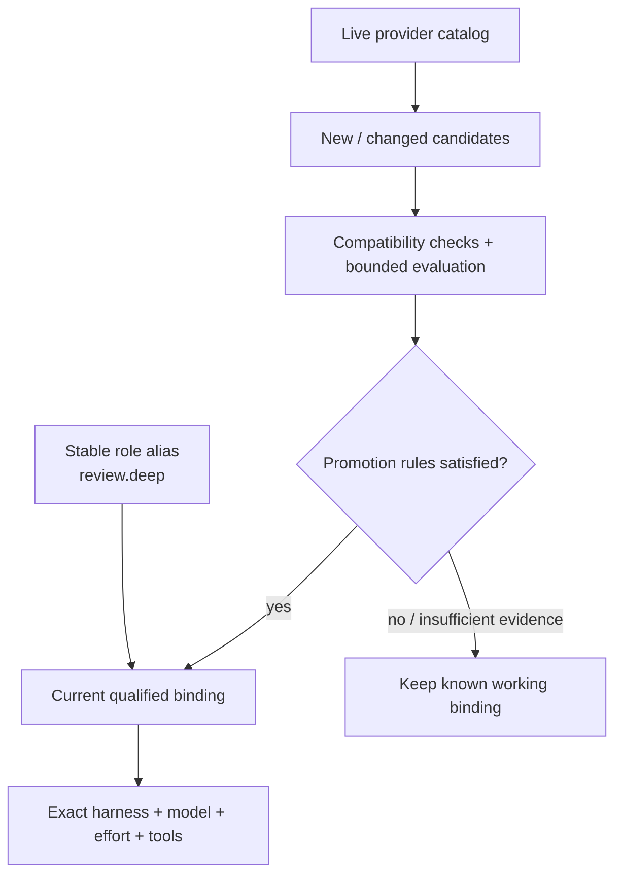
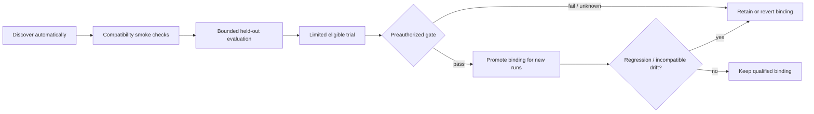

# Model releases without routine DevSquad code updates

**Design amendment, 2026-09-06; implementation pending.** Builds on [automatic selection](SELECTION-AND-COUNCIL.md), [contracts](CONTRACTS.md) and [ADR-002](../../adr/ADR-002-surface-independent-engineering-team.md). Incorporate into M1/M3/M6/M7; this adds no prerequisite platform or new core milestone.

## What to adopt from OpenAI's Claude Code plugin

Reviewed [openai/codex-plugin-cc](https://github.com/openai/codex-plugin-cc/tree/db52e28f4d9ded852ab3942cea316258ae4ef346), pinned at `db52e28f4d9ded852ab3942cea316258ae4ef346`. Source inspection only: no installation, account changes, session imports or live model requests.

| Source pattern | DevSquad application |
|---|---|
| App-server thread/turn operations and structured events | Prefer Codex's native protocol for new jobs; preserve the legacy shell wrapper |
| Native review and a separate steerable adversarial review | Distinguish ordinary defect review from a targeted challenge; record review mode |
| Stored job status/result and native thread IDs | Keep DevSquad run IDs plus native thread/turn IDs for recovery and reopening |
| Native turn interruption | Interrupt the owned turn before bounded process cleanup; confirm termination |
| Model/effort overrides with native defaults when omitted | Discover defaults as metadata; resolve a verified run profile before execution |

The implementation uses `review/start` for ordinary review and `turn/start` with effort/output schema for task execution. It also supports native thread resume and session import. These are concrete capabilities to reuse through an adapter. [Native integration source](https://github.com/openai/codex-plugin-cc/blob/db52e28f4d9ded852ab3942cea316258ae4ef346/plugins/codex/scripts/lib/codex.mjs).

The plugin distinguishes read-only reviews from delegated editing and provides structured findings plus instructions to preserve verdict/evidence boundaries. DevSquad should retain this distinction while applying the user's already-authorized workflow: a delivery task can include bounded corrections, whereas review-only scope cannot. [Review schema](https://github.com/openai/codex-plugin-cc/blob/db52e28f4d9ded852ab3942cea316258ae4ef346/plugins/codex/schemas/review-output.schema.json), [Result handling](https://github.com/openai/codex-plugin-cc/blob/db52e28f4d9ded852ab3942cea316258ae4ef346/plugins/codex/skills/codex-result-handling/SKILL.md).

The plugin's optional stop-time review gate can repeatedly return work to Claude; its README warns of extended loops and usage drain. DevSquad's existing task-scoped review gate, finite revisions and budgets remain the design. The plugin also uses the user's local Codex authentication/configuration and contributes to the same Codex limits. It does not create another allowance pool. [README](https://github.com/openai/codex-plugin-cc/blob/db52e28f4d9ded852ab3942cea316258ae4ef346/README.md).

Native Claude→Codex transcript import is an optional convenience when supported. It does not imply every host can import every other host's history. Keep portable artifact handoffs as the common interface. The source resolves the selected transcript under the real Claude projects directory before importing. [Transfer path validation](https://github.com/openai/codex-plugin-cc/blob/db52e28f4d9ded852ab3942cea316258ae4ef346/plugins/codex/scripts/lib/claude-session-transfer.mjs).

### Adapter amendment

The new adapter abstraction supports `transport: cli_exec | native_protocol`. Both expose discovery, validated preparation, execution events, interruption, result normalization and optional resume. Codex should use `native_protocol` when the installed app-server passes conformance. Other providers keep `cli_exec` unless they expose a verified suitable native interface.

For Codex, use a **DevSquad-owned stdio app-server child** inside the existing per-run supervisor. Avoid adding the upstream plugin's separate shared broker/job database as a second coordinator. Python owns that child's lifecycle; the adapter sends typed protocol requests. Store native thread/turn IDs and wait for actual completion notifications; accepting a start or interrupt request is not completion. Handle server requests with the declared role policy, never blanket-approve them. Use the isolated run worktree as native cwd and validate effective permissions. Protocol failure must not silently launch a duplicate CLI writer.

Generate/test protocol schemas against supported installed versions. Keep experimental methods behind capability checks. An explicit fallback transport must satisfy the same role/model/effort contract and be selected before launch, or after safe reconciliation. Standard `review/start` and custom `turn/start` do not necessarily accept identical effort controls; unsupported explicit combinations fail visibly. The Python coordinator remains unchanged in purpose; Bash callers keep their existing four-prefix API.

If implementation reuses upstream code, retain Apache-2.0 license/NOTICE obligations and pin provenance. Adopting behavior does not require vendoring the entire plugin. The protocol patterns are the immediate benefit; DevSquad still owns cross-provider scheduling, outcome evidence and worktree concurrency.

## Stable names above changing model releases

Workflows refer to stable **profile aliases**, for example `implement.balanced`, `review.deep`, `research.current`. These are DevSquad policy names, not guesses about provider tiers. Each alias binds to a tested concrete execution profile.

| Layer | Changes when |
|---|---|
| Workflow and role requirements | Your engineering process changes |
| Adapter code/protocol mapping | A CLI, protocol or permission interface changes |
| Model catalog and effort/tool metadata | Models or account-visible capabilities change |
| Alias → concrete profile binding | A replacement qualifies under the update policy |

**Routine model releases should be data updates.** A changed CLI/protocol or unsupported capability may still require an adapter update. This reduces maintenance; it cannot make third-party interfaces permanently stable.

### Discovery, not name guessing

Codex app-server documents `model/list` with supported/default reasoning efforts, modality and upgrade metadata, and `account/rateLimits/read` for quota observations. Its local generated schema also exposes these method types. This replaces DevSquad's current hardcoded `codex: unlistable` assumption. The upstream Claude plugin's execution code and the app-server's catalog API are distinct evidence sources; do not claim the plugin itself implements a model-release router. [Official app-server documentation](https://learn.chatgpt.com/docs/app-server).

Local verification used `codex app-server generate-json-schema` with the installed CLI and inspected `ModelListResponse`, `ThreadStartParams`, `TurnStartParams` and `GetAccountRateLimitsResponse`. This verifies available schema shapes, not account entitlement, model quality or a successful live model invocation.

DevSquad already has a [catalog implementation](../../../plugin/lib/model-catalog.sh) and detached refresh. Extend that intent, replacing numeric/keyword tier ranking with structured identity and compatibility. A model version number is not comparable across families, and a provider's recommended default/upgrade is a candidate recommendation, not a benchmark result.

Discovery contract:

- Cache per harness, installed version, authenticated account identity reference and configuration scope. Use native structured metadata first; otherwise a version-tested CLI parser or curated manifest. API catalogs cannot establish subscription-CLI entitlement.
- Refresh outside hooks on first use, stale cache (initial TTL 24 hours), a changed CLI/config fingerprint, or a relevant model-not-found signal. Deduplicate refreshes with a lease, timeout, backoff and pagination. No permanent polling service is required.
- Keep the last successful snapshot on timeout, auth failure, parse error or an incomplete response. Record staleness and errors separately. A failed refresh is never a mass-removal event. Confirm removal with a complete scoped catalog or an explicit model-unavailable response, distinguishing account/auth problems.
- Store exact IDs, provider family when verified, native effort options/defaults, modalities, tool evidence, deprecation/upgrade hints, source and timestamps. Missing fields remain unknown. Do not infer tools or reasoning levels from a model name.
- Generate a small number of candidate profiles from **existing allowed templates**. Start with the template's supported effort intent and at most one experimental alternative. Do not enumerate every model × effort × tool permutation. Unknown families or widened capabilities require a policy/template change.
- A provider alias can change behind the same public ID. Record reported effective identity/revision when available; otherwise label the backing revision unknown and use metadata drift plus periodic behavior checks. Reproducibility is best-effort when providers expose no immutable revision.

## Review the update rules once; automate routine promotion

This refines the earlier “update defaults after review” statement: **review can authorize a bounded promotion policy once**, rather than require a human to approve every qualifying model release. Start with reviewed promotions while calibrating the evaluation; enable guarded automation after those checks prove useful.

`model_updates.mode` is `reviewed` initially, or opt-in `guarded_auto`. A versioned update policy specifies allowed alias/templates/harnesses/families, evaluation cases/rubric, minimum evidence, quality non-inferiority criteria, critical-defect rule, latency/usage tolerances, candidate/trial budgets, rollback target and stop conditions. These are task-class-specific thresholds, not a global model leaderboard. Missing thresholds or insufficient evidence mean no automatic promotion.

Metadata refresh and candidate proposals are automatic. Inference-based probes/evaluations/trials require an enabled, bounded qualification budget, share the existing experiment allowance and respect account-pool limits. `guarded_auto` cannot silently enable paid APIs, new tools/permissions, a new account route or a different policy. Those changes remain reviewed. A policy may permit a low-risk candidate trial; high-risk work keeps the qualified incumbent until the gate passes. Ordinary model-launch counts and native usage remain distinct.

Promotion atomically updates an alias binding under a policy revision, records the previous binding and evidence IDs, and affects **new runs only**. Every run freezes the resolved concrete profile/fallback set before its worker starts. Active runs and pinned-profile overrides never move just because a new catalog appears. Retired/unavailable incumbents use an already-qualified fallback or block; do not substitute an untested “latest” model. Rollback also affects new attempts only after ownership is reconciled, and chooses an available qualified predecessor rather than a removed model.

Only revalidate affected combinations after effort/tool/protocol drift. Evidence remains attached to the original fingerprint; passing a previous model's evaluation is not inherited automatically. Reduce trial scope and retain the incumbent when budgets or usable cases are limited. Automatic promotion is a static gate over measured evidence, not an unconstrained learned router or a self-reported confidence score.

### State and documentation

Keep catalog snapshots and immutable concrete profiles in the runtime registry. Add `profile_templates`, `profile_bindings` and `qualification_runs` to the transactional store. Project policy references stable aliases and allowed templates; the local binding ledger determines the current qualified concrete profile for that installation/account. Resolve and snapshot binding versions with task preflight; idempotent start replay never re-resolves them.

Each binding change writes a local decision receipt: alias, old/new concrete IDs and fingerprints, effective/unknown settings, source release/catalog, evaluation/trial evidence, measured limits/usage, policy gate, rollback target and actor (`human` or `guarded_auto`). Derived Markdown reports summarize discovered, trialled, adopted, rejected and retired profiles. Curated exports remain available for Git documentation; runtime promotions do not edit or auto-commit the user's checkout. No new schedule or automation is installed by this design.

## Additions to existing milestone gates

| Milestone | Addition |
|---|---|
| M1 | Native/CLI transport contract; Codex app-server metadata; last-good catalog, templates and alias schema; unsupported effort handling |
| M3 | Resolve stable aliases to immutable profiles, explain selection and snapshot bindings; standard/adversarial review distinction |
| M6 | Qualification budget, reviewed/guarded-auto promotion, evidence receipts and rollback; real Codex quota observations when available |
| M7 | Compatibility fixtures across supported CLI/protocol versions and installation drift; document optional native session handoff |

Required cases: paginated discovery; incomplete/error catalog retains last-good entries; added model does not become default; changed effort support revalidates only affected profiles; same-ID drift retains uncertainty; alias promotion affects new runs only; exact pin never floats; insufficient trial evidence blocks promotion; permissions/billing changes cannot auto-promote; failed/retired incumbent uses only qualified fallback; concurrent promotions use compare-and-swap binding versions; regression rolls back and produces a decision receipt. Native adapter tests cover server disconnect, interruption acknowledgment without termination, isolated cwd/permissions and resuming a still-active turn without a duplicate writer.
