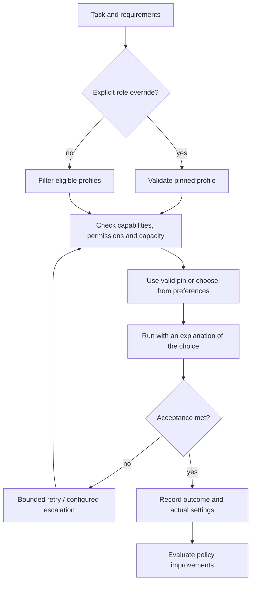
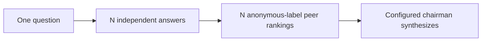
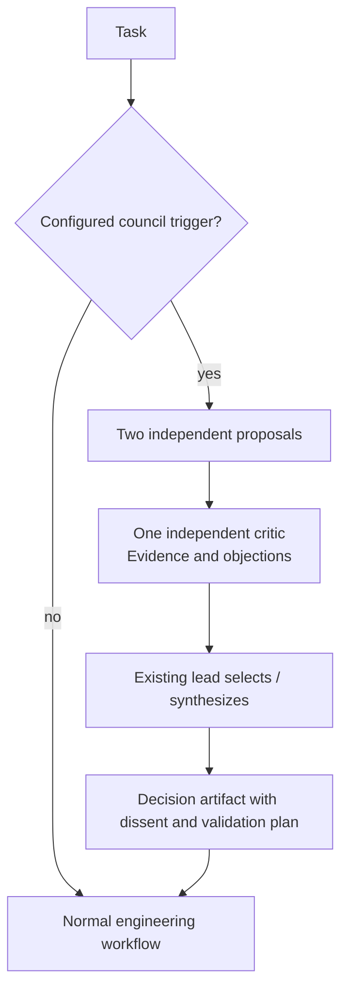

# Automatic selection and selective councils

**Design amendment, 2026-09-06. Nothing here is implemented yet.** Clarifies the [contracts](CONTRACTS.md) and adds a separately gated Council extension to [ADR-002](../../adr/ADR-002-surface-independent-engineering-team.md). It follows the user's question about automatic selection and LLM Council.

## Who chooses what?

**Everyday selection is automatic. Manual selection is an override. Changes to the selection policy are reviewed.**

| Decision | Owner |
|---|---|
| Discover installed harnesses, models, supported efforts and tools | DevSquad's discovery/probes |
| Connect accounts, identify shared allowance pools, set spending/access limits | User setup, assisted by discovery |
| Frame the task, scope, acceptance criteria and required capabilities | Current host lead, or supplied terminal task |
| Select model, effort and permitted toolbox for each role | Deterministic router applying versioned policy and current availability |
| Decide which permitted tool to call during work | Selected worker, inside the assigned permissions |
| Pin a particular configuration for this task | User override, resolved by the host into a validated profile |
| Collect outcomes and propose better configurations | DevSquad's evidence and evaluation loop |
| Promote a changed default policy | Reviewed versioned change, initially human-governed |

You should usually say “fix this issue” or “review this branch,” not fill in a model matrix. The host prepares a task; the router selects an eligible profile. The router itself needs no model call. A profile packages an exact harness/model, native effort setting, tool access, permission policy and account pool. Selection among tested combinations keeps the search space manageable.



Effort is selected with the profile. Easy work can use a proven lower-effort configuration; difficult work can use a stronger validated configuration. Escalation follows declared failure/rework rules and a finite budget. A higher effort label is not treated as a universal quality score, and no model gets an automatic maximum setting simply because it supports one.

The router selects the allowed toolbox; the worker chooses actual calls within it. Required X/search/video access must exist on that harness/profile. It cannot grant an app-native capability to an API model by naming the vendor. Selecting a profile never installs tools, adds permissions or purchases API usage implicitly.

### Override contract

Add optional `routing.overrides`, keyed by model role. Each value contains `profile_id` and `fallback` (`none` by default, or explicit `policy`). Empty/missing overrides means automatic selection for every role. Pinning one role leaves the other roles automatic. Pinning every model role gives manual assignment.

Illustrative fragment, using a fictional configured profile:

```json
{
  "routing": {
    "profiles_file": "devsquad/profiles.json",
    "policy_file": "devsquad/policy.json",
    "overrides": {
      "reviewer": {"profile_id": "my-verified-review-profile", "fallback": "none"}
    }
  }
}
```

Validate role names against the selected workflow. A pin must meet the same capability, identity, quality, permission and billing constraints as automatic candidates. Invalid settings return a validation error; temporary unavailability blocks with a reason. `fallback:none` never silently substitutes another profile. `fallback:policy` permits only the ordinary qualified candidate list and logs the substitution. Profile edits produce a new version; no live model/effort/tool mutation mid-attempt. All surfaces submit this same task shape.

Reports explain selections, excluded alternatives, explicit overrides, escalations and observed settings. An unmeasured or manually pinned trial must not be counted as proof of a general routing improvement.

## What LLM Council actually contributes

Studied **Karpathy's original repository**, pinned at [`92e1fcc`](https://github.com/karpathy/llm-council/tree/92e1fccb1bdcf1bab7221aa9ed90f9dc72529131). This is a source review, not a performance benchmark or a survey of forks. Its author describes it as an exploratory, unsupported project. [Original README](https://github.com/karpathy/llm-council/blob/92e1fccb1bdcf1bab7221aa9ed90f9dc72529131/README.md).



The code gives every ranker all successful answers, including its own, in the same order. The chairman sees named answers and raw critiques. Ranking uses permissive text parsing and average positions. For four members, a normal completed run makes **nine chat-completion requests**: four answers, four rankings, one synthesis. Ranker input repeats all answers, so aggregate answer-content volume grows roughly quadratically with membership. These are code-derived counts, not measured spending or quality improvements. [Council implementation](https://github.com/karpathy/llm-council/blob/92e1fccb1bdcf1bab7221aa9ed90f9dc72529131/backend/council.py).

Membership/chairman are configured explicitly; the API request supplies model and messages without effort, tool definitions or account-quota selection. It uses OpenRouter API access, so running this original app would not automatically draw from your CLI subscriptions or supply their native tools. [Configuration](https://github.com/karpathy/llm-council/blob/92e1fccb1bdcf1bab7221aa9ed90f9dc72529131/backend/config.py), [API client](https://github.com/karpathy/llm-council/blob/92e1fccb1bdcf1bab7221aa9ed90f9dc72529131/backend/openrouter.py).

Conversation files store stage outputs; the reviewed implementation has no evaluation-to-policy learning loop. The next question is sent without the stored conversation history. The first message adds a title-generation call, making the four-member initial exchange ten calls. [Storage](https://github.com/karpathy/llm-council/blob/92e1fccb1bdcf1bab7221aa9ed90f9dc72529131/backend/storage.py), [Request orchestration](https://github.com/karpathy/llm-council/blob/92e1fccb1bdcf1bab7221aa9ed90f9dc72529131/backend/main.py).

## Adopt the deliberation pattern inside DevSquad

| Adopt | DevSquad adaptation |
|---|---|
| Independent first opinions | Same frozen brief and evidence packet; participants cannot read each other's initial proposals |
| Peer critique | Criterion-by-criterion findings, source/test references and unresolved objections |
| Anonymous presentation | Hide profile metadata; store per-judge order and label mapping; counterbalance order in evaluations |
| One synthesis role | Existing host/headless lead explains the chosen approach and retains meaningful dissent |
| Inspectable stages | Persist proposals, critiques, decisions, failures and later outcomes as ordinary run artifacts |

My recommendation is **selective Council mode** for architectural tradeoffs, competing debugging hypotheses and consequential disputed reviews. Routine delivery keeps implementer → independent reviewer → checks. Agreement is useful evidence to examine; it cannot override failing tests or prove a claim true. Research on LLM judges documents position, verbosity and self-enhancement biases, supporting calibration rather than treating peer ranks as ground truth. [LLM-as-a-judge study](https://arxiv.org/abs/2306.05685).



Proposed starting budget: two proposers, one critic, and one headless lead = **four worker invocations before DevSquad-level retries**. With a host lead, there are three worker invocations plus separately recorded host work. A native CLI worker can perform several model/tool turns; these units are not comparable to the original Council's nine API requests. This smaller deliberation protocol needs its own quality/capacity evaluation. Count launches using `max_worker_invocations`, recording native usage and context bytes separately. Council participants stay read-only; it never creates several concurrent implementation writers.

### C1 — Optional Council extension after M6

**Dependencies:** M3–M6 through M6. C1 is a separate pending extension and does not block M7 or first usability. Reuse the runner, adapters, artifacts, routing, cancellation and evidence store. No additional service or UI platform.

Add a feature-gated `council-decision` workflow after the two core workflows are proven. M1–M7 schemas keep the original workflow enum until C1 is implemented; expose supported workflows through doctor. C1 adds the new enum and its strict configuration schemas together, with a documented contract revision.

- **Inputs:** Existing task/criteria/scope/budget plus a CouncilSpec: proposer candidate profiles, critic candidate profiles, evidence artifact IDs/hashes, rubric, minimum valid proposals (two), critic requirement (one), maximum council invocations and a reason for invocation. Proposer/critic profiles use the same pin/fallback semantics as ordinary roles. The normal lead remains the sole decision authority. Stage barriers and role-scoped filesystem/MCP artifact access withhold peer proposals until every initial proposal is finalized; independence cannot rely on prompt wording alone.
- **Selection:** Automatically choose two distinct verified model identities and a critic whose model identity differs from both authors. Prefer independent families where qualified, without inferring independence from harness names. If the minimum eligible set or budget is unavailable, report the council as blocked; do not manufacture a quorum. The ordinary engineering workflow remains separately available.
- **Critique:** No self-scoring. Hide identity metadata, retain raw provenance separately, and record reproducible randomized presentation order. Anonymity is partial because writing/content can reveal identity. Require structured criterion assessments and evidence references; validate missing/duplicate/unknown candidate IDs. Avoid forcing an overall numeric rank.
- **Decision:** Save supported claims, chosen proposal or synthesis, discarded alternatives, unresolved objections and required validation. The lead cannot turn majority preference into test acceptance. Failed providers, missing evidence and critic failure are explicit; there is no silent “consensus” when participants drop out.
- **Tools:** A common baseline evidence packet makes proposals comparable. Additional native research is allowed only by profile and declared scope, with its sources retained. Unequal evidence access is recorded as a confounder for model comparisons. Check code claims through the normal trusted verification path.
- **Triggers:** Start with explicit user/lead request and a capped policy allowance. Automatic triggering remains disabled until C1's comparison gate passes. Later policy may trigger on declared architectural decisions or unresolved evidence-backed review conflicts; model self-confidence alone is not a trigger. One council per decision by default; additional rounds consume explicit allowance.
- **Learning:** Compare normal workflow vs selective council on matched/held-out cases: accepted quality, escaped defects, lead rework, latency and observed allowance. Keep question, profile, effort, prompt and evidence versions. Council rank or agreement never directly promotes a model globally.

**Acceptance:** Proposers cannot see each other's draft artifacts; critic cannot author-score; shuffled labels map back correctly. Fake fixtures cover missing proposer, missing critic, invalid judgement IDs, empty output, quota exhaustion, cancellation/resume and recorded dissent. A seeded wrong majority cannot override a failed mandatory check. A live bounded council yields an inspectable decision using existing subscription adapters. A predeclared held-out comparison records benefit, harm or inconclusive results; automatic use stays disabled unless a reviewed policy change is supported. Receipt includes every worker attempt, failed attempts and available native usage, not just the selected answer.
