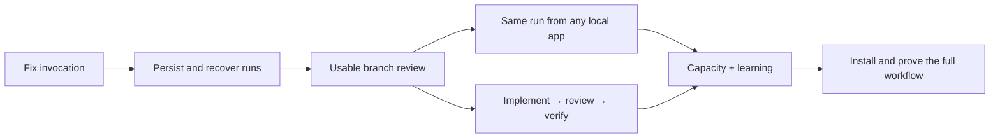

# DevSquad: coding-agent entry point

**Build status: planned, not implemented.** This packet follows the local/GitHub review and Dikshant's September 6 brief. Start with M1; do not run another open-ended architecture exercise.

**Full-build assignment:** Use [SOL-HANDOFF.md](SOL-HANDOFF.md) for the user's request to have Sol execute everything, test thoroughly and make normal use simple. It includes M1–M7 plus the opt-in Council feature, and adds guided task entry over the same contracts.

> Build an AI engineering team that can be operated from terminal, Codex, Claude Code, Antigravity and Grok. Use each eligible model/effort/tool configuration where it produces the best verified outcome; account for shared subscription limits. Preserve work across surfaces, learn from attempts and maintain the evidence automatically.



## Read and execute

1. Read [ADR-002](../../adr/ADR-002-surface-independent-engineering-team.md) for boundaries and decisions.
2. Implement the [contracts](CONTRACTS.md), using the [examples](examples/branch-review.json) as fixtures, not live model configuration.
3. Work through [IMPLEMENTATION](IMPLEMENTATION.md), one milestone at a time. [backlog.json](backlog.json) is the completion record; all milestones initially have `status: pending` and empty evidence.
4. Consult the [assessment](../../audits/2026-09-06-engineering-team-assessment.md) for verified defects and history, and [ADR-001](../../adr/ADR-001-contract-and-ledger-core.md) for legacy constraints retained by ADR-002.

Selection is automatic by default, with validated per-role profile overrides. Read the [selection and LLM Council amendment](SELECTION-AND-COUNCIL.md) for the clarified contract. Its optional C1 extension follows M6 and does not block the seven core milestones.

Also read the [native adapters and model lifecycle amendment](MODEL-LIFECYCLE-AND-NATIVE-ADAPTERS.md): use verified Codex app-server capabilities, stable profile aliases, automatic catalog updates and qualified binding promotions. These refine M1/M3/M6/M7; they add no prerequisite milestone and do not require rewriting workflows for each model release.

## Copyable execution brief

```text
Implement DevSquad's September engineering-team plan in this repository.
Read docs/plans/engineering-team/START-HERE.md and its contracts first.
Start at the earliest pending milestone whose dependencies are complete.
Implement M1 and pass its gate, then continue through M2–M7 and C1.
Preserve existing Bash 3.2 wrapper callers and their four error prefixes.
Keep all distributable core files inside plugin/core; add no cloud service.
Use fake CLIs for development; real provider runs are bounded smoke tests.
Do not change global AI account settings or silently switch to paid APIs.
Before marking a milestone complete, record the revision, checks, outcome,
and a reproducible receipt in backlog.json and update the relevant docs.
Run bash test/run.sh before each commit as CONTRIBUTING.md requires.
Commit each verified milestone. Continue through all ready work;
report exact blockers rather than claiming unsupported integrations work.
```

The initial architecture is decided. Routine implementation choices need no renewed architecture approval. If a discovery changes a contract, document the small proposed change and its impact in an ADR amendment; preserve compatibility or version the contract.

## Completion means evidence

| Claim | Required proof |
|---|---|
| Adapter works | Fake-binary conformance, supported flag mapping, one bounded real smoke receipt |
| Recovery works | Crash with live child; resume never creates a second writer |
| Surface works | Start/status/handoff or cancel from that installed application |
| Delivery works | Exact patch, independent review, checks and disposition all linked |
| Router improved | Comparable cases, all attempts, failures and rework; versioned evaluation |

Keep planned and implemented features visibly separate. Do not mark M4/M7 complete merely because a config file parses, or a host advertises MCP support. Do not rewrite `.planning/STATE.md`'s historical February “100%” into a claim about this build.

## Scope guard

First usable product: **a saved branch review**. Next: **one bounded code change reviewed by another model**. Two functioning harnesses are sufficient to prove the engineering workflow; M7 verifies access from every requested local surface. Do not force every provider into every run.

Defer a dashboard, universal DAG builder, remote execution service, automatic model training/router, plugin marketplace, autonomous merges and scheduled documentation jobs. Existing plugin behavior remains available while the new runner is opt-in; switching hook suggestions to the new route source happens only after its gate passes.

No new runtime, host registration, provider call, deployment or automation was created by this architecture packet.
