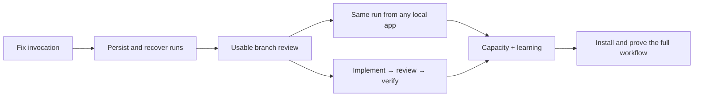

# DevSquad: coding-agent entry point

**Build status: implementation in progress.** After an interruption, read
[RESUME.md](RESUME.md) first and compare it with current Git state. M1/M2 are
accepted; the September 29 review reopened M3 acceptance integrity and M5–M7
implementation gaps. M4's actual Claude handoff remains externally blocked.
Execute [SOL-REVIEW-FOLLOWUP.md](SOL-REVIEW-FOLLOWUP.md) and use
[backlog.json](backlog.json) for evidence. Do not restart the architecture
exercise.

**Full-build assignment:** Use [SOL-HANDOFF.md](SOL-HANDOFF.md) for the user's request to have Sol execute everything, test thoroughly and make normal use simple. It includes M1–M7 plus the opt-in Council feature, and adds guided task entry over the same contracts.

**Git starting point:** `codex/engineering-team` is the shared local/GitHub build branch. `main` remains the published runtime baseline. The [branch consolidation record](../../audits/2026-09-06-branch-consolidation.md) documents the preserved history and recovery paths. Continue this branch, or base a Codex worktree on it; verify the complete handoff checkpoint `ff1fa60` is an ancestor before coding.

> Build an AI engineering team that can be operated from terminal, Codex, Claude Code, Antigravity and Grok. Use each eligible model/effort/tool configuration where it produces the best verified outcome; account for shared subscription limits. Preserve work across surfaces, learn from attempts and maintain the evidence automatically.


```mermaid
flowchart LR
    A[Fix invocation] --> B[Persist and recover runs]
    B --> C[Usable branch review]
    C --> D[Same run from any local app]
    C --> E[Implement → review → verify]
    D --> F[Capacity + learning]
    E --> F
    F --> G[Install and prove the full workflow]
```

## Read and execute

1. Read [ADR-002](../../adr/ADR-002-surface-independent-engineering-team.md) for boundaries and decisions.
2. Implement the [contracts](CONTRACTS.md), using the [examples](examples/branch-review.json) as fixtures, not live model configuration.
3. Work through [IMPLEMENTATION](IMPLEMENTATION.md), one milestone at a time. [backlog.json](backlog.json) is the current completion record; resume the earliest unfinished requirement whose dependencies are ready.
4. Consult the [assessment](../../audits/2026-09-06-engineering-team-assessment.md) for verified defects and history, and [ADR-001](../../adr/ADR-001-contract-and-ledger-core.md) for legacy constraints retained by ADR-002.

Selection is automatic by default, with validated per-role profile overrides. Read the [selection and LLM Council amendment](SELECTION-AND-COUNCIL.md) for the clarified contract. Its optional C1 extension follows M6 and does not block the seven core milestones.

Also read the [native adapters and model lifecycle amendment](MODEL-LIFECYCLE-AND-NATIVE-ADAPTERS.md): use verified Codex app-server capabilities, stable profile aliases, automatic catalog updates and qualified binding promotions. These refine M1/M3/M6/M7; they add no prerequisite milestone and do not require rewriting workflows for each model release.

The September 26 [Jev/Laya evaluation and decision-helper amendment](DECISION-CLASSIFIERS.md)
adds optional M6 experiments for routing hints, skill selection and context
ranking, with further bounded uses prioritized. It changes no runtime defaults
and does not delay M5. The only current hosted authorization is the explicitly
capped one-request, $0.01 synthetic Jev pilot; no purchase, retry or private
task upload is authorized.

## Copyable execution brief

```text
Implement DevSquad's September engineering-team plan in this repository.
Read docs/plans/engineering-team/RESUME.md, current Git state,
SOL-REVIEW-FOLLOWUP.md, START-HERE.md and the relevant contracts first.
Preserve existing implementation and historical receipts.
R1's source repair is verified; start with R2's observed-identity regressions, then execute the remaining
review packages through M5–M7 and C1. Do not restart completed M1/M2 work.
Preserve existing Bash 3.2 wrapper callers and their four error prefixes.
Keep all distributable core files inside plugin/core; add no cloud service.
Use fake CLIs for development; real provider runs are bounded smoke tests.
Do not change global AI account settings or silently switch to paid APIs.
Before marking a milestone complete, record the revision, checks, outcome,
and a reproducible receipt in backlog.json and update the relevant docs.
Run bash test/run.sh before each commit as CONTRIBUTING.md requires.
Commit each verified milestone. Continue through all ready work;
report exact blockers rather than claiming unsupported integrations work.
```

The initial architecture is decided. Routine implementation choices need no renewed architecture approval. If a discovery changes a contract, document the small proposed change and its impact in an ADR amendment; preserve compatibility or version the contract.

## Completion means evidence

| Claim | Required proof |
|---|---|
| Adapter works | Fake-binary conformance, supported flag mapping, one bounded real smoke receipt |
| Recovery works | Crash with live child; resume never creates a second writer |
| Surface works | Start/status/handoff or cancel from that installed application |
| Delivery works | Exact patch, independent review, checks and disposition all linked |
| Router improved | Comparable cases, all attempts, failures and rework; versioned evaluation |

Keep planned and implemented features visibly separate. Do not mark M4/M7 complete merely because a config file parses, or a host advertises MCP support. Do not rewrite `.planning/STATE.md`'s historical February “100%” into a claim about this build.

## Scope guard

First usable product: **a saved branch review**. Next: **one bounded code change reviewed by another model**. Two functioning harnesses are sufficient to prove the engineering workflow; M7 verifies access from every requested local surface. Do not force every provider into every run.

Defer a dashboard, universal DAG builder, remote execution service, automatic model training or unreviewed learned policy changes, plugin marketplace, autonomous merges and scheduled documentation jobs. Optional evaluated decision hints are bounded by the classifier amendment, not a replacement for deterministic policy. Existing plugin behavior remains available while the new runner is opt-in; switching hook suggestions to the new route source happens only after its gate passes.

This packet began as architecture only. Current implementation and live-probe
evidence are tracked in RESUME.md, the milestone status and backlog; they do
not yet establish that the full engineering-team product is usable.
